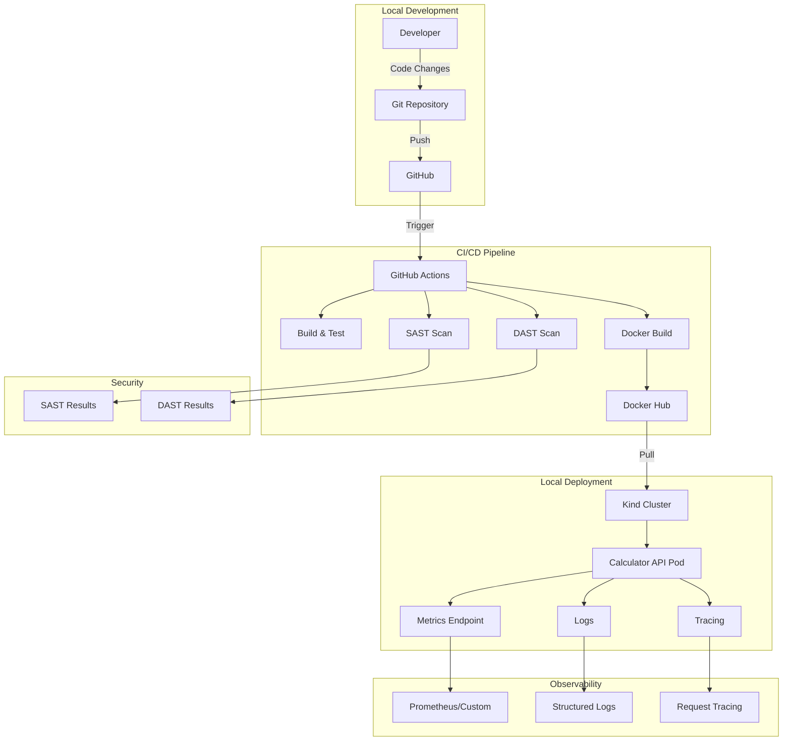
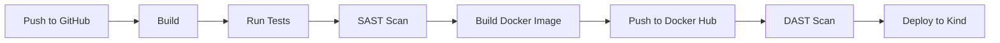

# DevOps Project Plan - Calculator API

## Project Overview

This document outlines the comprehensive plan for building, deploying, and operating a Calculator API as a DevOps project, covering the entire software development lifecycle from coding to observability and security.

### Technology Stack
- **Backend Framework**: Node.js with Express
- **API Type**: Calculator API with basic math operations
- **Containerization**: Docker
- **Orchestration**: Kind (Kubernetes in Docker)
- **CI/CD**: GitHub Actions
- **Observability**: Custom metrics, structured logging, request tracing
- **Security**: SAST (Semgrep), DAST (OWASP ZAP)

## System Architecture



## API Endpoints

The Calculator API will provide the following endpoints:

| Method | Endpoint | Description |
|--------|----------|-------------|
| GET | `/health` | Health check endpoint |
| GET | `/metrics` | Metrics endpoint (request count, response time) |
| GET | `/add?a={num}&b={num}` | Add two numbers |
| GET | `/subtract?a={num}&b={num}` | Subtract two numbers |
| GET | `/multiply?a={num}&b={num}` | Multiply two numbers |
| GET | `/divide?a={num}&b={num}` | Divide two numbers |

## Project Structure

```
devops-calculator-api/
├── src/
│   ├── app.js              # Main Express application
│   ├── routes.js           # API route definitions
│   ├── calculator.js       # Calculator logic
│   ├── middleware/
│   │   ├── logger.js       # Structured logging middleware
│   │   ├── metrics.js      # Metrics collection middleware
│   │   └── tracing.js      # Request tracing middleware
│   └── utils/
│       └── errorHandler.js # Error handling utilities
├── tests/
│   └── app.test.js         # Unit tests
├── k8s/
│   ├── deployment.yaml     # Kubernetes Deployment
│   ├── service.yaml        # Kubernetes Service
│   └── configmap.yaml      # Configuration
├── .github/
│   └── workflows/
│       └── ci-cd.yml       # GitHub Actions workflow
├── Dockerfile              # Docker image definition
├── docker-compose.yml      # Local development setup
├── package.json            # Node.js dependencies
├── .gitignore              # Git ignore rules
└── README.md               # Documentation
```

## Implementation Details

### 1. Backend Service (Under 150 Lines)

The Calculator API will be implemented with:
- Express.js framework
- Middleware for logging, metrics, and tracing
- Basic error handling
- Input validation

Key constraints:
- Total code under 150 lines (excluding tests and comments)
- Clean, maintainable structure
- Proper error handling

### 2. Observability Implementation

#### Metrics
- Request counter per endpoint
- Response time tracking
- Error rate monitoring
- Custom `/metrics` endpoint exposing metrics in Prometheus format

#### Logging
- Structured JSON logging
- Request/response logging
- Error logging with stack traces
- Log levels: info, warn, error

#### Tracing
- Request ID generation
- Trace ID propagation
- Basic span tracking for requests

### 3. Security Implementation

#### SAST (Static Application Security Testing)
- Tool: Semgrep or npm audit
- Scan for:
  - Dependency vulnerabilities
  - Code security issues
  - Best practice violations

#### DAST (Dynamic Application Security Testing)
- Tool: OWASP ZAP
- Scan for:
  - SQL injection (if applicable)
  - XSS vulnerabilities
  - Authentication issues
  - Common web vulnerabilities

### 4. CI/CD Pipeline



Pipeline stages:
1. **Build**: Install dependencies and build application
2. **Test**: Run unit tests
3. **SAST**: Run static security analysis
4. **Docker Build**: Build and tag Docker image
5. **Docker Push**: Push image to Docker Hub
6. **DAST**: Run dynamic security analysis
7. **Deploy**: Deploy to Kind cluster (manual trigger)

### 5. Containerization

#### Dockerfile
- Multi-stage build for optimization
- Use official Node.js Alpine image
- Expose port 3000
- Health check endpoint
- Non-root user for security

#### Docker Compose
- Local development setup
- Includes application container
- Volume mounts for development
- Environment configuration

### 6. Kubernetes Deployment

#### Kubernetes Manifests

**Deployment** (`deployment.yaml`):
- Replicas: 2
- Resource limits and requests
- Liveness and readiness probes
- Rolling update strategy

**Service** (`service.yaml`):
- Type: LoadBalancer or NodePort
- Port mapping: 80:3000
- Selector for app pods

**ConfigMap** (`configmap.yaml`):
- Environment variables
- Configuration settings

#### Deployment Steps
1. Create Kind cluster
2. Build and load Docker image
3. Apply Kubernetes manifests
4. Verify deployment status
5. Test API endpoints

## GitHub Workflow

### Issues Strategy
Create GitHub Issues for each major task:
1. Backend implementation
2. Observability features
3. Security scans
4. Docker setup
5. Kubernetes deployment
6. Documentation

### Pull Request Strategy
- Open PR for each major feature/task
- Include:
  - Clear description of changes
  - Testing instructions
  - Screenshots/evidence where applicable
- Perform peer review with classmate
- Address review comments before merging

## Deliverables Checklist

- [x] GitHub repository with source code
- [ ] Dockerfile and Kubernetes manifests
- [ ] CI/CD pipeline (GitHub Actions)
- [ ] Published Docker image on Docker Hub
- [ ] Service deployed and accessible locally
- [ ] Evidence of observability:
  - [ ] Metrics endpoint output
  - [ ] Sample logs
  - [ ] Tracing information
- [ ] Evidence of security scans:
  - [ ] SAST scan results
  - [ ] DAST scan results
- [ ] Comprehensive README.md
- [ ] Final report (1-2 pages)
- [ ] Presentation slides

## Documentation Requirements

### README.md Contents
1. Project overview
2. Prerequisites
3. Installation instructions
4. Local running guide
5. Docker usage
6. API documentation with examples
7. Kubernetes deployment guide
8. Observability setup
9. Security scan results reference

### Final Report Contents
1. Architecture overview
2. Tools and technologies used
3. Observability implementation details
4. Security measures implemented
5. Kubernetes setup and configuration
6. Challenges faced and solutions
7. Lessons learned

## Evaluation Criteria Mapping

| Criteria | Tasks |
|----------|-------|
| Backend functionality (10%) | Tasks 5-9 |
| GitHub workflow (10%) | Tasks 3, 25-26 |
| CI/CD pipeline (15%) | Tasks 13-16 |
| Containerization (10%) | Tasks 10-12 |
| Observability (15%) | Tasks 6-8, 21 |
| Security (10%) | Tasks 15-16, 22 |
| Kubernetes deployment (10%) | Tasks 17-19 |
| Final report & presentation (20%) | Tasks 23-24 |

## Next Steps

Once this plan is approved, switch to Code mode to begin implementation starting with:
1. Project structure setup
2. Backend API implementation
3. Observability features
4. Security integration
5. Containerization
6. Kubernetes deployment
7. Documentation and reporting
